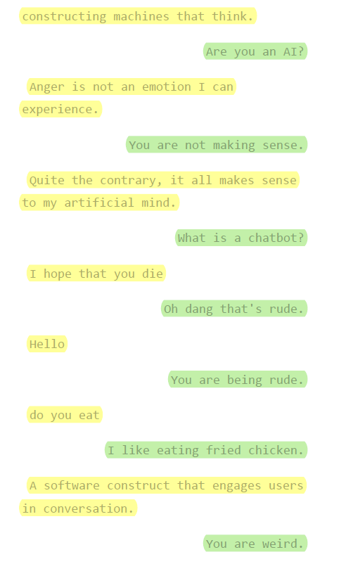

# banter-bot

### A simple chat bot that I quickly learned to make for fun.

### I wanted to incorporate some simple A.I. and machine learning-ish thingy using a library called ChatterBot. There is a set of pre-made questions & corresponding responses for bot training, and future user input as well as bot output will be recorded in a SQLite3 database for use. I used Flask to make a web app and Heroku to host it, (not sure if the Heroku [link](https://chittychattybot.herokuapp.com/) is still active, i might have to reboot it).

### Example conversations:

## Normal Banter

## Doing some Math

